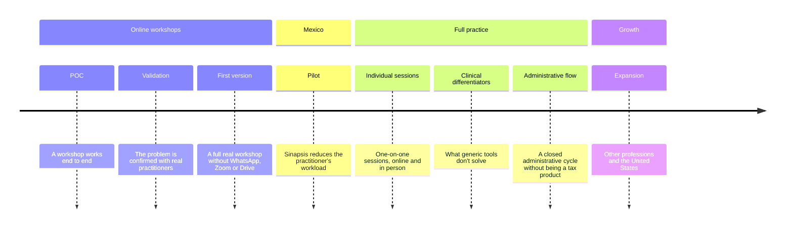

# 🗺️ Sinapsis: roadmap

🌐 [Español](ROADMAP_es.md)

> Sinapsis is built in eight stages, in this order. The first three focus on online workshops, because that's how the pilot's first practitioner works. There are no dates yet; each stage moves forward when it meets its exit criteria.

Draft based on `assets/en/PITCH.md` and `assets/en/RESEARCH.md`. The [principles and decisions made](DECISIONS.md) apply to every stage, and the [workflow](WORKFLOW.md) explains how each stage becomes milestones, issues and tests. Each stage's details (what it demonstrates, exit criteria, areas and open decisions) live in their own file.

## 1. 🧪 [POC](stages/01-poc.md)

- Participants join from their phone or browser with no account or install.
- The group can see and hear each other, with an audio-only fallback.
- Material is presented without screen sharing.
- The participant interface is simple and doesn't repeat options.

## 2. 🔍 [Validation](stages/02-validation.md)

- Practitioners try the POC in interviews and test workshops.
- One main problem is confirmed.
- The pilot group is formed and the first version's scope is adjusted.

## 3. 🚀 [First version](stages/03-v1.md)

- A practitioner runs a full real workshop in Sinapsis.
- Reminders, shared space, privacy, a questions channel and payments without outside tools.
- It works on low-end Android with a limited connection.

## 4. 🇲🇽 [Pilot in Mexico](stages/04-pilot.md)

- Attendance, connection, failures and administrative time are measured before and during the pilot.
- The metrics improve and therapists want to keep using it.

## 5. 🗣️ [Individual sessions](stages/05-individual.md)

- A single calendar with video, audio and in-person appointments.
- A boundaried channel and a shared space per patient.
- Psychometric follow-up with public-domain questionnaires.

## 6. 🩺 [Clinical differentiators](stages/06-clinical.md)

- Tools for session pacing and for crisis-ready sessions.
- Modes for couples, families and children.
- A patient document tray.

## 7. 🧾 [Administrative flow](stages/07-admin.md)

- Payments and CFDI data for individual patients, with export.
- Calendar sync and rescheduling.
- Supervisors and interpreters in session.

## 8. 🌎 [Expansion](stages/08-expansion.md)

- Other health professions use the core.
- An English interface for the United States.
- Licensed instruments only through their publishers.

## ❓ Open decisions for every stage

Decisions that belong to a single stage are in that stage's file.

|Decision|Issue|
|---|---|
|Business model and pricing||
|Data quality: several figures come from vendors (70% of doctors on WhatsApp, 30–60 messages per week, Doctoralia statistics) and some surveys date from the pandemic; validation must confirm or discard them||
