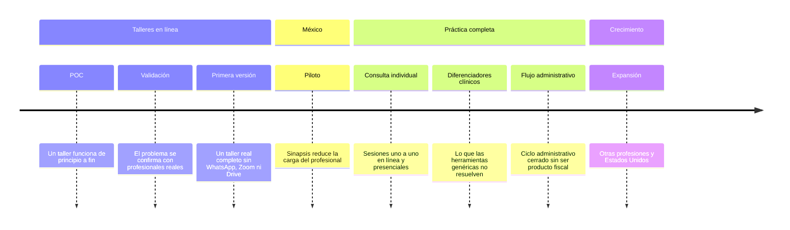

# 🗺️ Sinapsis: roadmap

> Sinapsis se construye en ocho etapas, en este orden. Las tres primeras se centran en talleres en línea, porque así trabaja la primera profesional del piloto. No hay fechas todavía; cada etapa avanza cuando cumple sus criterios de salida.

Borrador basado en `assets/es/PITCH.md` y `assets/es/RESEARCH.md`. Los [principios](PRINCIPLES.md) aplican a todas las etapas, y el [flujo de trabajo](WORKFLOW.md) explica cómo cada etapa se vuelve milestones, issues y pruebas. El detalle de cada etapa (qué demuestra, criterios de salida, áreas y decisiones abiertas) está en su propio archivo.

## 1. 🧪 [POC](stages/01-poc.md)

- Los participantes entran desde el celular o navegador sin cuenta ni instalación.
- El grupo se ve y se escucha, con respaldo de solo audio.
- El material se presenta sin compartir pantalla.
- La interfaz del participante es simple y no repite opciones.

## 2. 🔍 [Validación](stages/02-validation.md)

- Los profesionales prueban el POC en entrevistas y talleres de prueba.
- Se confirma un problema principal.
- Se forma el grupo del piloto y se ajusta el alcance de la primera versión.

## 3. 🚀 [Primera versión](stages/03-v1.md)

- Una profesional conduce un taller real completo en Sinapsis.
- Avisos, espacio compartido, privacidad, canal de dudas y cobros sin herramientas externas.
- Funciona en Android de gama baja con conexión limitada.

## 4. 🇲🇽 [Piloto en México](stages/04-pilot.md)

- Se mide asistencia, conexión, fallas y tiempo administrativo antes y durante el piloto.
- Las métricas mejoran y los terapeutas quieren seguir usándolo.

## 5. 🗣️ [Consulta individual](stages/05-individual.md)

- Una agenda única con citas en video, audio y presenciales.
- Canal con encuadre y espacio compartido por paciente.
- Seguimiento psicométrico con cuestionarios de dominio público.

## 6. 🩺 [Diferenciadores clínicos](stages/06-clinical.md)

- Herramientas para el ritmo de sesión y para sesiones preparadas para crisis.
- Modos para parejas, familias y niños.
- Bandeja de documentos del paciente.

## 7. 🧾 [Flujo administrativo](stages/07-admin.md)

- Cobros y datos para CFDI de pacientes individuales, con exportación.
- Sincronización de calendarios y reagenda.
- Supervisores e intérpretes en sesión.

## 8. 🌎 [Expansión](stages/08-expansion.md)

- Otras profesiones de la salud usan el núcleo.
- Interfaz en inglés para Estados Unidos.
- Instrumentos con licencia solo vía sus editoriales.

## ❓ Decisiones abiertas para todas las etapas

Las decisiones de una sola etapa están en el archivo de esa etapa.

| Decisión                                                                                                                                                                                                                             | Issue |
| ------------------------------------------------------------------------------------------------------------------------------------------------------------------------------------------------------------------------------------ | ----- |
| Modelo de negocio y precios                                                                                                                                                                                                          |       |
| Calidad de los datos: varias cifras vienen de proveedores (70% de médicos en WhatsApp, 30–60 mensajes por semana, estadísticas de Doctoralia) y algunas encuestas son de la pandemia; la validación debe confirmarlas o descartarlas |       |
